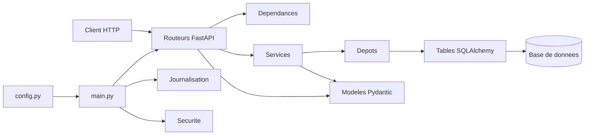

# API Jeux

API REST développée avec FastAPI pour gérer un catalogue de jeux vidéo.

## Prérequis

Avant de lancer le projet, disposer de :

- Python 3.14.7
- Git 2.54.0
- pip 26.2.1


## Démarrage rapide

### 1. Cloner le dépôt

```bash
git clone https://github.com/minna-lab/api-jeux--groupe-.git
cd api-jeux--groupe-
```

### 2. Créer l'environnement virtuel

```bash
python -m venv .venv
```

### 3. Activer l'environnement virtuel

Sous Linux/macOS :

```bash
source .venv/bin/activate
```

Sous Windows :

```powershell
.venv\Scripts\activate
```

Si PowerShell refuse l'activation des scripts :

```powershell
Set-ExecutionPolicy -Scope Process Bypass
```

Puis relancer :

```powershell
.venv\Scripts\activate
```

### 4. Installer les dépendances
Cette commande installe les dépendances nécessaires au fonctionnement du projet ainsi que les dépendances de développement et de test.
```bash
pip install -r requirements-dev.txt
```

### 5. Créer le fichier d'environnement

Sous Linux/macOS :

```bash
cp .env.example .env
```

Sous Windows :

```powershell
copy .env.example .env
```

Configurer ensuite le fichier `.env`.

Exemple de configuration de développement :

```env
DATABASE_URL=sqlite:///./jeux.db
CLE_SECRETE=remplacez-moi
```

Aucun vrai secret ne doit être ajouté au dépôt.

### 6. Peupler la base de données

```bash
python scripts/peupler.py
```

Cette commande crée le catalogue de démonstration.

### 7. Lancer l'API

```bash
fastapi dev app/main.py
```

Résultat attendu :

- le serveur FastAPI démarre ;
- l'API est accessible localement ;
- la documentation interactive est disponible à l'adresse :

`http://127.0.0.1:8000/docs`

## Configuration

La configuration de l'application est centralisée dans `app/config.py` et chargée depuis le fichier `.env`.

Les variables `DATABASE_URL` et `CLE_SECRETE` sont obligatoires. Les autres variables sont facultatives et disposent d'une valeur par défaut.

| Variable | Rôle | Obligatoire | Valeur par défaut |
|---|---|---|---|
| `DATABASE_URL` | URL de connexion à la base de données | Oui | Aucune |
| `CLE_SECRETE` | Clé secrète utilisée par l'application, notamment pour les jetons | Oui | Aucune |
| `ALGORITHME_JETON` | Algorithme utilisé pour les jetons d'authentification | Non | `HS256` |
| `DUREE_JETON_MINUTES` | Durée de validité d'un jeton en minutes | Non | `30` |
| `ORIGINES_AUTORISEES` | Liste des origines autorisées pour les requêtes CORS | Non | `["http://localhost:5173"]` |
| `ENVIRONNEMENT` | Définit l'environnement d'exécution de l'application | Non | `developpement` |
| `NIVEAU_JOURNAL` | Niveau de journalisation de l'application | Non | `INFO` |
| `ECHO_SQL` | Active ou désactive l'affichage des requêtes SQL | Non | `False` |
| `MAX_TENTATIVES_CONNEXION` | Nombre maximal de tentatives de connexion autorisées | Non | `5` |
| `FENETRE_TENTATIVES_MINUTES` | Durée de la fenêtre utilisée pour compter les tentatives de connexion | Non | `15` |

Exemple minimal de fichier `.env` pour le développement :

```env
DATABASE_URL=sqlite:///./jeux.db
CLE_SECRETE=remplacez-moi
```

Les vraies clés, mots de passe ou jetons ne doivent jamais être versionnés dans Git.

## Utilisation

Une fois l'application lancée, la documentation interactive de l'API est disponible sur :

`http://127.0.0.1:8000/docs`

Quelques exemples de routes utilisées dans le projet :

### Consulter les statistiques du catalogue

```http
GET /api/v1/jeux/statistiques
```

Cette route retourne les statistiques du catalogue de jeux.

Pour un catalogue vide, la moyenne retournée doit être `0.0`.

### Consulter les jeux

```http
GET /api/v1/jeux
```

Cette route permet de récupérer les jeux du catalogue.

### Consulter un jeu

```http
GET /api/v1/jeux/{id}
```

Cette route permet de récupérer un jeu à partir de son identifiant.

Pour consulter l'ensemble des routes et leurs formats d'entrée et de sortie, utiliser `/docs`.

## Tests

Pour lancer l'ensemble des tests :

```bash
python -m pytest
```

Résultat attendu :

```text
tous les tests passent
```

Pour vérifier la qualité du code avec Ruff :

```bash
ruff check .
```

Résultat attendu :

```text
aucune erreur signalée
```

Les tests doivent être exécutés avant la création ou la validation d'une Pull Request.

## Architecture

L'application est organisée en plusieurs couches.



### Organisation du dossier `app/`

- `app/depots/` : contient les fonctions d'accès aux données et les requêtes vers la base de données.

- `app/modeles/` : contient les modèles de données utilisés par l'API, notamment pour la validation des entrées et sorties.

- `app/routeurs/` : contient les routes HTTP exposées par FastAPI.

-` app/services/` : contient la logique métier de l'application.

- `app/tables/` : contient les tables SQLAlchemy utilisées pour représenter les données persistées.

- `app/base_donnees.py` : configure la connexion à la base de données et les sessions SQLAlchemy.

- `app/config.py` : centralise et valide la configuration de l'application.

- `app/dependances.py` : contient les dépendances FastAPI réutilisées par les routes.

-` app/donnees_initiales.py` : contient les données ou traitements nécessaires à l'initialisation de l'application.

- `app/exceptions.py` : contient la gestion des exceptions spécifiques à l'application.

- `app/journalisation.py` : configure la journalisation et les logs de l'application.

- `app/main.py ` : point d'entrée principal de l'application FastAPI.

- `app/securite.py` : contient les fonctions liées à la sécurité et à l'authentification.

- `app/__init__.py` : indique que app est un package Python.

## Contribuer

Le projet suit un workflow basé sur les issues, les branches et les Pull Requests.

### 1. Partir d'un `main` à jour

```bash
git switch main
git pull
```

### 2. Choisir ou créer une issue

Une issue doit correspondre à un seul problème ou besoin.

La personne qui commence le travail s'assigne l'issue.

### 3. Créer une branche dédiée

Les branches suivent la convention :

```text
type/numero-description
```

Exemples :

```text
fix/1-statistiques-catalogue-vide
feat/15-filtre-annees
docs/readme
```

Il ne faut pas pousser directement sur `main`.

### 4. Réaliser les modifications

Les commits doivent être courts, lisibles et correspondre à une intention précise.

Exemple :

```text
fix(jeux): gérer les statistiques d'un catalogue vide
```

### 5. Pousser la branche

```bash
git push -u origin nom-de-la-branche
```

### 6. Ouvrir une Pull Request

La Pull Request doit expliquer :

- le contexte ;
- les changements réalisés ;
- l'impact ;
- comment tester ;
- les vérifications effectuées.

Lorsqu'une PR corrige une issue, utiliser :

```text
Closes #NUMERO
```

afin que l'issue soit fermée automatiquement lors de la fusion.

### 7. Faire relire la Pull Request

Un autre membre de l'équipe relit le changement.

Les commentaires de relecture utilisent les étiquettes suivantes :

- `issue:` problème bloquant ;
- `suggestion:` amélioration proposée ;
- `question:` besoin de clarification ;
- `nit:` détail non bloquant ;
- `thought:` idée hors périmètre ;
- `praise:` élément réussi.

Les commentaires portent sur le code et expliquent la raison de la remarque.

### 8. Répondre à la relecture

L'auteur répond à chaque commentaire et réalise les corrections nécessaires.

Après modification, il pousse les nouveaux commits puis demande une nouvelle relecture.

### 9. Approuver et fusionner

Une fois :

- la relecture terminée ;
- les conversations résolues ;
- les tests réussis ;
- la CI verte ;

la Pull Request peut être approuvée puis fusionnée.

L'équipe peut utiliser `Squash and merge` afin de conserver un historique lisible avec un commit par Pull Request.

### 10. Supprimer la branche

Après la fusion, supprimer la branche devenue inutile.